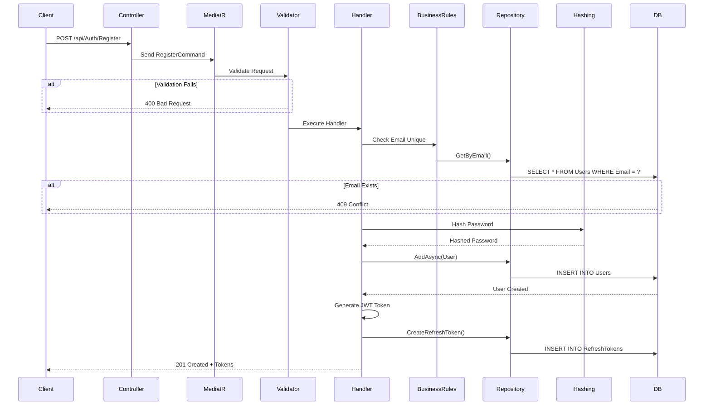

# İç Akış ve Veri Akışı Dokümantasyonu

## 📊 Sistem İç Akış Diyagramı

Bu dokümantasyon, Cakir QR Menu sisteminin iç işleyişini, veri akışlarını ve iş süreçlerini detaylı olarak açıklar.

---

## 🔄 Genel Sistem Akışı

### 1. Uygulama Başlatma Akışı

```
1. Program.cs başlatılır
   ↓
2. Configuration yüklenir (appsettings.json)
   ↓
3. Dependency Injection Container yapılandırılır
   │
   ├── Application Services (MediatR, AutoMapper, FluentValidation)
   ├── Security Services (JWT, Hashing, Encryption)
   ├── Persistence Services (DbContext, Repositories)
   └── Infrastructure Services (External services)
   ↓
4. Middleware Pipeline yapılandırılır
   │
   ├── Exception Handling
   ├── Authentication
   ├── Authorization
   ├── CORS
   └── Swagger
   ↓
5. Database bağlantısı kontrol edilir
   ↓
6. Uygulama çalışmaya başlar
```

---

## 🔐 Kimlik Doğrulama Akışı

### Kullanıcı Kayıt Akışı



**Detaylı Adımlar**:

1. **İstek Alınması**:
   - Client, kayıt bilgilerini gönderir
   - Controller, RegisterCommand nesnesi oluşturur

2. **Validasyon**:
   ```csharp
   - Email formatı kontrolü
   - Şifre güvenlik kontrolü (min 8 karakter, büyük/küçük harf, rakam)
   - Gerekli alanların dolu olması
   ```

3. **İş Kuralları Kontrolü**:
   ```csharp
   - Email benzersizliği
   - Email domain kontrolü (opsiyonel)
   - Spam koruması
   ```

4. **Şifre Hashleme**:
   ```csharp
   - BCrypt algoritması kullanımı
   - Salt üretimi
   - Hash üretimi
   ```

5. **Kullanıcı Oluşturma**:
   - User entity oluşturma
   - Default rol atama
   - Veritabanına kaydetme

6. **Token Üretimi**:
   - Access token (15 dakika)
   - Refresh token (7 gün)

### Kullanıcı Giriş Akışı

```
1. Client giriş bilgilerini gönderir
   ↓
2. LoginCommand oluşturulur
   ↓
3. Validation Pipeline
   │
   ├── Email format kontrolü
   └── Şifre boş olmamalı
   ↓
4. Handler çalışır
   │
   ├── Kullanıcı email ile aranır
   ├── Kullanıcı bulunamazsa: 401 Unauthorized
   ├── Kullanıcı pasifse: 403 Forbidden
   └── Kullanıcı bulunursa: Devam
   ↓
5. Şifre doğrulama
   │
   ├── Hash karşılaştırma
   └── Eşleşmezse: 401 Unauthorized
   ↓
6. 2FA Kontrolü
   │
   ├── 2FA aktifse: Auth code talep et
   └── 2FA pasifse: Devam
   ↓
7. Token üretimi
   │
   ├── Access token
   ├── Refresh token
   └── User claims
   ↓
8. Response dönülür
   │
   ├── Tokens
   ├── User info
   └── Expiration dates
```

### İki Faktörlü Doğrulama (2FA) Akışı

#### Email 2FA Akışı:

```
1. EnableEmailAuthenticator komutu
   ↓
2. 6 haneli kod üret
   ↓
3. Kodu veritabanına kaydet (TTL: 5 dakika)
   ↓
4. Email gönder
   ↓
5. Kullanıcı kodu girer
   ↓
6. VerifyEmailAuthenticator komutu
   ↓
7. Kod kontrolü
   │
   ├── Geçerli: Email authenticator aktif et
   └── Geçersiz/Süresi dolmuş: Hata
   ↓
8. Başarılı aktivasyon mesajı
```

#### OTP 2FA Akışı:

```
1. EnableOtpAuthenticator komutu
   ↓
2. Secret key üret (Base32)
   ↓
3. QR kod üret
   │
   ├── Secret key + User email
   ├── Issuer bilgisi (App name)
   └── QR görsel oluştur
   ↓
4. Secret key ve QR kod dön
   ↓
5. Kullanıcı Authenticator app'e ekler
   ↓
6. 6 haneli kod üretilir (TOTP)
   ↓
7. VerifyOtpAuthenticator komutu
   ↓
8. Kod doğrulama
   │
   ├── Time-based kod kontrolü
   ├── 30 saniyelik zaman penceresi
   └── Geçerli: OTP authenticator aktif et
   ↓
9. Başarılı aktivasyon
```

---

## 🍽️ Menü ve Ürün Yönetimi Akışı

### Yeni Menü Oluşturma ve QR Kod Üretimi

```
1. Client menü oluşturma isteği gönderir
   ↓
2. CreateMenuCommand oluşturulur
   ↓
3. Authorization Pipeline
   │
   └── CompanyAdmin veya Admin rolü kontrolü
   ↓
4. Validation Pipeline
   │
   ├── Menü adı boş olmamalı
   ├── Company ID geçerli olmalı
   └── Açıklama max 500 karakter
   ↓
5. Handler çalışır
   │
   ├── Company varlığı kontrolü
   ├── Menü adı benzersizliği (aynı company için)
   └── İş kuralları kontrolü
   ↓
6. Menu entity oluştur
   ↓
7. Veritabanına kaydet
   ↓
8. QR Kod oluşturma kontrolü (generateQrCode: true ise)
   │
   ├── Menu URL üret: https://domain.com/menu/{menuId}
   ├── QR kod servisi çağır
   ├── QR görsel üret (PNG)
   ├── MenuQrCode entity oluştur
   └── Veritabanına kaydet
   ↓
9. Response dön
   │
   ├── Menu bilgileri
   ├── QR kod bilgileri (varsa)
   └── Success message
```

### Ürün Ekleme ve Görsel Yükleme Akışı

```
1. Ürün bilgileri gönderilir
   ↓
2. CreateItemCommand
   ↓
3. Pipeline işlemleri
   │
   ├── Authorization (MenuManager rolü)
   ├── Validation
   └── Business rules
   ↓
4. Item entity oluştur
   ↓
5. Veritabanına kaydet
   ↓
6. [Opsiyonel] Görsel yükleme
   │
   ├── File upload
   ├── Görsel validasyonu (format, boyut)
   ├── Dosya adı üretimi (GUID)
   ├── Storage'a kaydet (File system / Cloud storage)
   ├── ItemImage entity oluştur
   │   ├── ImageUrl: Storage path
   │   ├── IsPrimary: true/false
   │   └── Order: Sıra numarası
   └── Veritabanına kaydet
   ↓
7. [Opsiyonel] Malzeme bilgileri
   │
   ├── ItemIngredient entity oluştur
   ├── Malzeme listesi
   ├── Alerjen bilgileri
   └── Veritabanına kaydet
   ↓
8. Response dön
   │
   ├── Item detayları
   ├── Görsel URL'leri
   └── Success message
```

---

## 🔍 Veri Sorgulama Akışı

### Menü Listeleme (Sayfalama ve Filtreleme)

```
1. Client listeleme isteği (GET /api/Menus?pageIndex=0&pageSize=10)
   ↓
2. GetListMenuQuery oluşturulur
   │
   ├── PageRequest (index, size)
   ├── Filters (optional)
   └── Sorts (optional)
   ↓
3. Authorization (Gerekirse)
   ↓
4. Caching Pipeline kontrolü
   │
   ├── Cache key oluştur: "MenuList_Page0_Size10_Filter..."
   ├── Cache'de var mı kontrol et
   └── Varsa: Cache'den dön (DB'ye gitmez)
   ↓
5. Handler çalışır (Cache miss ise)
   │
   ├── Repository.GetListAsync()
   ├── Filtering uygula
   ├── Sorting uygula
   └── Pagination uygula
   ↓
6. LINQ to SQL
   │
   └── SELECT * FROM Menus 
       WHERE CompanyId = @companyId
       ORDER BY CreatedDate DESC
       OFFSET @offset ROWS
       FETCH NEXT @size ROWS ONLY
   ↓
7. Mapping (AutoMapper)
   │
   └── Entity → DTO dönüşümü
   ↓
8. Cache'e kaydet (TTL: 5 dakika)
   ↓
9. GetListResponse dön
   │
   ├── Items: List<MenuDto>
   ├── Index: Sayfa numarası
   ├── Size: Sayfa boyutu
   ├── Count: Toplam kayıt
   ├── Pages: Toplam sayfa
   ├── HasPrevious: bool
   └── HasNext: bool
```

### Dinamik Sorgulama (Dynamic Query)

```
1. Client dinamik sorgu gönderir
   │
   └── POST /api/Menus/GetListByDynamic
       {
         "filter": {
           "field": "CompanyId",
           "operator": "eq",
           "value": "1"
         },
         "sort": [
           { "field": "MenuName", "dir": "asc" }
         ],
         "pagination": { "pageIndex": 0, "pageSize": 10 }
       }
   ↓
2. GetListByDynamicMenuQuery oluşturulur
   ↓
3. Dynamic query builder çalışır
   │
   ├── Filter expression oluştur
   ├── Sort expression oluştur
   └── IQueryable<Menu> oluştur
   ↓
4. Expression'lar veritabanı sorgusuna dönüşür
   │
   └── LINQ to SQL translation
   ↓
5. Sorgu çalıştırılır
   ↓
6. Response dönülür
```

---

## 📱 QR Kod Tarama ve Menü Görüntüleme Akışı

```
1. Müşteri QR kodu tarar
   ↓
2. Browser açılır: https://domain.com/menu/{menuId}
   ↓
3. Frontend uygulama yüklenir
   ↓
4. API çağrısı: GET /api/Menus/{menuId}
   ↓
5. Authorization kontrolü (Public endpoint - gereksiz)
   ↓
6. Cache kontrolü
   │
   └── "Menu_{menuId}_Details"
   ↓
7. Handler çalışır
   │
   ├── Menu bilgileri getir
   ├── İlişkili kategorileri getir (Include)
   ├── Her kategorinin ürünlerini getir (Include)
   ├── Ürün görsellerini getir (Include)
   └── Active olmayan ürünleri filtrele
   ↓
8. Mapping işlemi
   │
   └── Menu → MenuDetailDto
       ├── Categories → List<CategoryDto>
       │   └── Items → List<ItemDto>
       │       └── Images → List<ImageDto>
   ↓
9. Response dön
   ↓
10. Frontend render eder
   │
   ├── Menü başlığı ve açıklama
   ├── Kategori listesi
   └── Her kategorinin ürünleri
       ├── Ürün görseli
       ├── Ürün adı ve açıklaması
       ├── Fiyat
       └── Alerjen bilgileri (varsa)
```

---

## 🔄 Veri Güncelleme ve Cache Invalidation Akışı

### Ürün Güncelleme ve Cache Temizleme

```
1. Client güncelleme isteği gönderir
   │
   └── PUT /api/Items/{id}
       { "itemName": "Yeni İsim", "price": 99.90 }
   ↓
2. UpdateItemCommand oluşturulur
   ↓
3. Authorization Pipeline
   │
   └── MenuManager veya Admin kontrolü
   ↓
4. Validation Pipeline
   │
   ├── Id > 0
   ├── Item adı boş değil
   └── Fiyat >= 0
   ↓
5. Transaction Pipeline başlar
   │
   └── BEGIN TRANSACTION
   ↓
6. Handler çalışır
   │
   ├── Item varlık kontrolü
   ├── Business rules (Fiyat limitleri vs.)
   ├── Update işlemi
   └── Repository.UpdateAsync()
   ↓
7. Database güncelleme
   │
   └── UPDATE Items SET ... WHERE Id = @id
   ↓
8. Cache Invalidation
   │
   ├── "Item_{id}_Details" → Sil
   ├── "ItemList_CategoryId_{categoryId}" → Sil
   ├── "Menu_{menuId}_Details" → Sil
   └── İlgili tüm cache key'leri temizle
   ↓
9. Transaction COMMIT
   ↓
10. Response dön
    │
    └── UpdatedItemResponse
```

---

## 🔐 Authorization Pipeline Akışı

```
1. HTTP Request gelir
   ↓
2. JWT Middleware devreye girer
   │
   ├── Authorization header kontrolü
   ├── "Bearer {token}" parse et
   ├── Token validasyonu
   │   ├── Signature kontrolü
   │   ├── Expiration kontrolü
   │   ├── Issuer kontrolü
   │   └── Audience kontrolü
   └── User claims çıkar
   ↓
3. Controller action çağrılır
   ↓
4. MediatR Command/Query gönderilir
   ↓
5. Authorization Behavior
   │
   ├── Attribute kontrolü: [AuthorizeOperation]
   │   ├── Attribute varsa: Rol kontrolü
   │   │   ├── User.IsInRole(requiredRole)
   │   │   └── Yoksa: 403 Forbidden
   │   └── Attribute yoksa: Devam
   │
   ├── Resource-based authorization (opsiyonel)
   │   ├── Kullanıcı kendi kaynağına mı erişiyor?
   │   │   └── Örnek: User sadece kendi profilini güncelleyebilir
   │   └── Admin her şeye erişebilir
   │
   └── Policy-based authorization (opsiyonel)
       └── Complex business rules
   ↓
6. İzin varsa: Handler çalışır
   İzin yoksa: UnauthorizedException fırlatılır
```

**Rol Hiyerarşisi ve Yetkiler**:

```
Admin
  ├── Tüm Company işlemleri (CRUD)
  ├── Tüm Menu işlemleri (CRUD)
  ├── Tüm Item işlemleri (CRUD)
  ├── User yönetimi (CRUD)
  └── Operation Claim yönetimi (CRUD)

CompanyAdmin (Sadece kendi şirketi)
  ├── Menu işlemleri (CRUD)
  ├── Category işlemleri (CRUD)
  ├── Item işlemleri (CRUD)
  └── Company bilgileri (Update)

MenuManager (Atandığı menüler)
  ├── Category işlemleri (CRUD)
  ├── Item işlemleri (CRUD)
  └── Menu bilgileri (Read, Update)

User (Sadece okuma)
  └── Public menüleri görüntüleme
```

---

## 📝 Validation Pipeline Akışı

```
1. Command/Query MediatR'a gönderilir
   ↓
2. Validation Behavior devreye girer
   ↓
3. FluentValidation kuralları çalışır
   │
   ├── Synchronous validations
   │   ├── NotEmpty rules
   │   ├── Length rules
   │   ├── Range rules
   │   ├── Email format rules
   │   └── Regex rules
   │
   └── Asynchronous validations
       ├── Database uniqueness checks
       ├── Foreign key validations
       └── Custom business rules
   ↓
4. Validation sonucu
   │
   ├── Başarılı: Handler'a devam
   │
   └── Başarısız: ValidationException
       ├── Error collection oluştur
       │   └── [
       │         { "property": "Email", "message": "Geçersiz format" },
       │         { "property": "Price", "message": "0'dan büyük olmalı" }
       │       ]
       ├── 400 Bad Request
       └── Error details dön
```

**Validation Örneği**:

```csharp
public class CreateItemCommandValidator : AbstractValidator<CreateItemCommand>
{
    private readonly IItemRepository _itemRepository;
    
    public CreateItemCommandValidator(IItemRepository itemRepository)
    {
        _itemRepository = itemRepository;
        
        // Synchronous rules
        RuleFor(x => x.ItemName)
            .NotEmpty().WithMessage("Ürün adı boş olamaz")
            .MaximumLength(100).WithMessage("Ürün adı max 100 karakter olabilir");
            
        RuleFor(x => x.Price)
            .GreaterThanOrEqualTo(0).WithMessage("Fiyat 0'dan küçük olamaz")
            .LessThan(10000).WithMessage("Fiyat 10000'den küçük olmalı");
        
        // Async rules
        RuleFor(x => x)
            .MustAsync(ItemNameMustBeUniqueInCategory)
            .WithMessage("Bu kategoride aynı isimde ürün mevcut");
    }
    
    private async Task<bool> ItemNameMustBeUniqueInCategory(
        CreateItemCommand command, 
        CancellationToken cancellationToken)
    {
        var existingItem = await _itemRepository.GetAsync(
            x => x.CategoryId == command.CategoryId && 
                 x.ItemName == command.ItemName
        );
        return existingItem == null;
    }
}
```

---

## 🔄 Transaction Management Akışı

```
1. Command MediatR'a gönderilir
   ↓
2. Transaction Behavior devreye girer
   │
   ├── Attribute kontrolü: [TransactionScope]
   └── Attribute varsa: Transaction başlat
   ↓
3. Database transaction başlar
   │
   └── BEGIN TRANSACTION
   ↓
4. Handler ve business logic çalışır
   │
   ├── Repository operations
   ├── Multiple entity updates
   └── Complex operations
   ↓
5. Başarılı mı?
   │
   ├── Evet: COMMIT TRANSACTION
   │   └── Tüm değişiklikler kalıcı olur
   │
   └── Hayır (Exception): ROLLBACK TRANSACTION
       ├── Tüm değişiklikler geri alınır
       ├── Exception fırlatılır
       └── Error response dönülür
```

**Kullanım Örneği**:

```csharp
[TransactionScope]
public class CreateMenuWithItemsCommand : IRequest<CreatedMenuResponse>
{
    // Hem menu hem de items oluşturulacak
    // Hata olursa hiçbiri oluşturulmayacak (Atomic operation)
}
```

---

## 📊 Logging Pipeline Akışı

```
1. Her request geldiğinde
   ↓
2. Logging Behavior devreye girer
   ↓
3. Request bilgileri loglanır
   │
   ├── Request type: Command/Query name
   ├── User: User Id and email
   ├── Timestamp: Request time
   └── Request data: Serialized command/query
   ↓
4. Handler çalışır
   ↓
5. Response loglanır
   │
   ├── Response type: Success/Failure
   ├── Execution time: Milliseconds
   ├── Response data: Serialized response (if success)
   └── Error details: Exception details (if failure)
   ↓
6. Structured logs Serilog ile yazılır
   │
   ├── Console (Development)
   ├── File (All environments)
   ├── Elasticsearch (Production - opsiyonel)
   └── Application Insights (Cloud - opsiyonel)
```

**Log Örneği**:

```json
{
  "timestamp": "2024-01-15T10:30:45.123Z",
  "level": "Information",
  "messageTemplate": "Request handled {RequestType}",
  "properties": {
    "RequestType": "CreateItemCommand",
    "UserId": 1,
    "UserEmail": "user@example.com",
    "ExecutionTime": 245,
    "Success": true
  }
}
```

---

## 🎯 Performans Optimizasyonu Akışları

### 1. Caching Strategy

```
Read Operations:
  ↓
1. Request gelir
  ↓
2. Cache key oluştur
  ↓
3. Cache'de var mı?
  │
  ├── Var: Cache'den dön (Fast path)
  │   └── ~5-10ms response time
  │
  └── Yok: Database'e git (Slow path)
      ├── Query çalıştır
      ├── Response oluştur
      ├── Cache'e kaydet (TTL: 5-60 dakika)
      └── Response dön
      └── ~50-200ms response time

Write Operations:
  ↓
1. Update/Delete işlemi
  ↓
2. Database güncelleme
  ↓
3. İlgili cache key'lerini temizle
  │
  ├── Direkt key (Item_123)
  ├── List key'leri (ItemList_*)
  └── Related entity key'leri (Menu_*, Category_*)
  ↓
4. Response dön
```

### 2. Pagination Strategy

```
Large Dataset Request:
  ↓
1. Client sayfa talep eder (page: 5, size: 20)
  ↓
2. Database'de offset hesapla
  │
  └── OFFSET = (page * size) = (5 * 20) = 100
  ↓
3. Limited query
  │
  └── SELECT * FROM Items
      ORDER BY Id
      OFFSET 100 ROWS
      FETCH NEXT 20 ROWS ONLY
  ↓
4. Sadece istenen sayfayı dön
  │
  └── Memory efficient, fast response
```

### 3. Eager Loading vs Lazy Loading

```
Eager Loading (Recommended for API):
  ↓
  var menu = await context.Menus
      .Include(m => m.Categories)
          .ThenInclude(c => c.Items)
              .ThenInclude(i => i.Images)
      .FirstOrDefaultAsync(m => m.Id == id);
  ↓
  Tek SQL query, tüm data birden gelir
  ↓
  Efficient, N+1 problem yok

Lazy Loading (Dikkatli kullan):
  ↓
  var menu = await context.Menus.FindAsync(id);
  foreach (var category in menu.Categories) // Ayrı query
  {
      foreach (var item in category.Items) // Ayrı query
      {
          var images = item.Images; // Ayrı query
      }
  }
  ↓
  Çok sayıda SQL query, yavaş
  ↓
  N+1 problem riski
```

---

## 🚨 Exception Handling Akışı

```
1. Exception oluşur (Handler veya Business Rule)
   ↓
2. Exception Middleware yakalar
   ↓
3. Exception tipini kontrol et
   │
   ├── BusinessException
   │   ├── Status: 400 Bad Request
   │   └── User-friendly message dön
   │
   ├── ValidationException
   │   ├── Status: 400 Bad Request
   │   └── Validation errors listesi dön
   │
   ├── NotFoundException
   │   ├── Status: 404 Not Found
   │   └── Entity not found message dön
   │
   ├── AuthorizationException
   │   ├── Status: 403 Forbidden
   │   └── Unauthorized message dön
   │
   └── Unhandled Exception
       ├── Status: 500 Internal Server Error
       ├── Log details (Stack trace)
       └── Generic error message dön (Production'da detay yok)
   ↓
4. Error response oluştur
   │
   └── {
       "type": "BusinessException",
       "title": "İş Kuralı Hatası",
       "status": 400,
       "detail": "Aynı isimde ürün zaten mevcut",
       "timestamp": "2024-01-15T10:30:00Z",
       "traceId": "00-abc123..."
     }
   ↓
5. Client'a dön
```

---

Bu dokümantasyon, sistemin tüm iç akışlarını ve veri akışlarını detaylı olarak açıklamaktadır. Her akış, gerçek dünya senaryolarına göre optimize edilmiş ve best practice'lere uygun olarak tasarlanmıştır.
